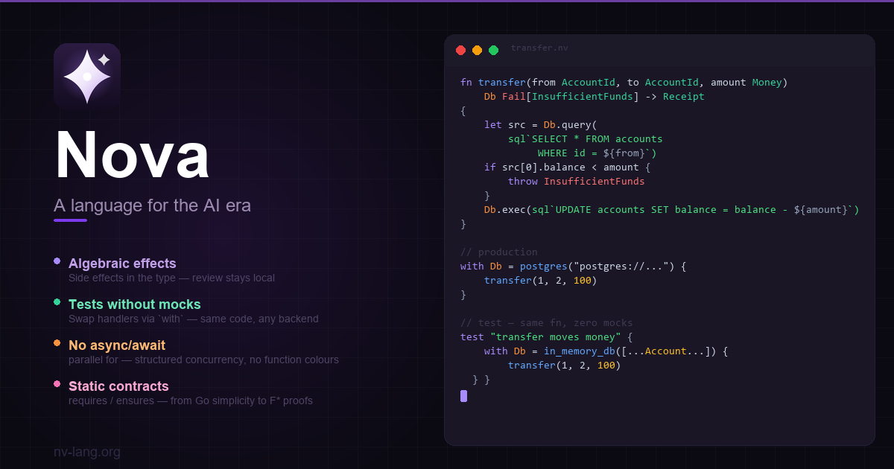
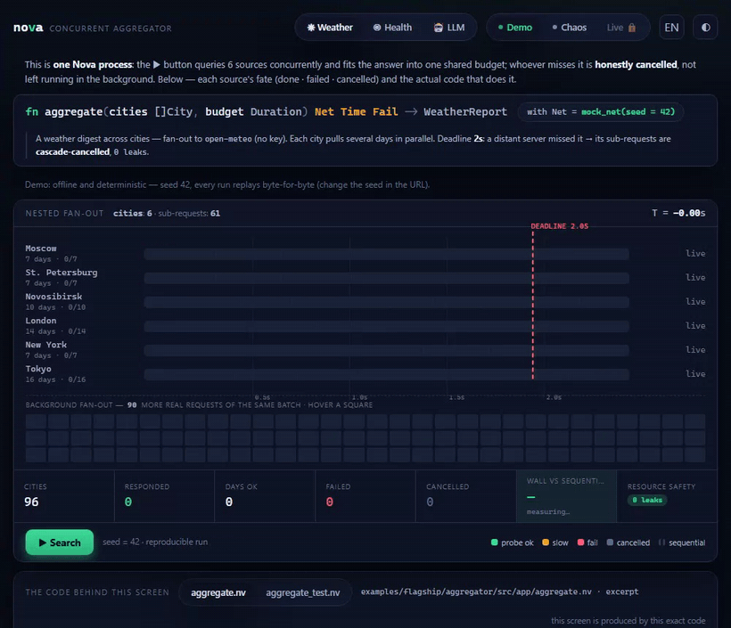

<div align="center">
  

  <h1>Nova</h1>

  <p><strong>A programming language for the AI era</strong></p>

  <p>
    <a href="https://nv-lang.org">Website</a> |
    <a href="docs/guide/quickstart.md">Quickstart</a> |
    <a href="spec/overview.md">Documentation</a> |
    <a href="CONTRIBUTING.md">Contributing</a>
  </p>

  <p><strong>English</strong> | <a href="README.ru.md">Русский</a></p>

  
</div>

---

Nova compiles to C, then to a native binary — no VM, no interpreter.
Every function's side effects (`Db`, `Net`, `Io`, `Time`, ...) are part of
its type, checked by the compiler, so a reviewer can tell what a function
touches without reading its body. Memory is managed by a Boehm GC by
default; for resources that need deterministic, pause-free cleanup
(files, sockets, locks) `consume`/ownership gives you a guaranteed
`on_exit` at scope end, with no GC in the loop. Concurrency is
structured (`spawn`, `parallel for`, `supervised`) on an M:N
work-stealing fiber scheduler — no `async`/`await`, no function-colour
split. The standard library ships with batteries included: `std`
(collections, IO, time, JSON, ...) plus separately versioned `net`,
`tls`, `http`, and `compress` packages.

```nova
fn process_order(o Order) Db Net Time Fail -> Receipt
```

Reading this single line, you know the function:

- talks to the **database** (`Db`)
- makes **network requests** (`Net`)
- reads **the clock** (`Time`) — so its result depends on time
- can **throw an error** (`Fail`)
- and **nothing else**: it doesn't write files, read stdin, or use
  randomness — otherwise it would be in the signature.

This is **algebraic effects** — an idea from the academic language
Koka, brought to a practical form. When side effects are visible in
the type, review becomes local: you can verify a function without
reading its body or the bodies of all the things it calls.

> **Nova's main bet:** more and more code will be written by LLMs,
> but humans will still review it. Languages designed before the AI
> era are optimized for the opposite ratio. Nova is the first
> language explicitly optimized for the «LLM writes, human reviews»
> pair.

> ⚠️ The full language specification is currently only available in
> Russian. See [spec/decisions/](spec/decisions/) and [spec/](spec/).
> This README gives an English overview of the core ideas.

## Show me the code

### 1. Effect → handler → tests without mocks

```nova
// Declare an effect — a contract of operations, no fields
type Db effect {
    query(q Sql) -> []Row
    exec(q Sql)  -> ()
}

// Business logic: Db effect in the signature, implementation unknown
fn transfer(from u64, to u64, amount money) Db Fail -> () {
    ro src = Db.query(sql`SELECT * FROM accounts WHERE id = ${from}`)
    if src[0].balance < amount { throw InsufficientFunds }
    Db.exec(sql`UPDATE accounts SET balance = balance - ${amount} WHERE id = ${from}`)
    Db.exec(sql`UPDATE accounts SET balance = balance + ${amount} WHERE id = ${to}`)
}

// Production: real handler
fn main() Io Fail -> () =>
    with Db = postgres("postgres://...") {
        transfer(1, 2, 100)
    }

// Test: same code, in-memory handler, no mocks at all
test "transfer moves money" {
    ro mem = in_memory_db([
        Account { id: 1, balance: 500 },
        Account { id: 2, balance: 0 },
    ])
    with Db = mem {
        transfer(1, 2, 100)
        assert(mem.get(1).balance == 400)
        assert(mem.get(2).balance == 100)
    }
}
```

The same `transfer` runs in production and in tests — because the
`Db` implementation is supplied via `with`, not hard-wired in the
code. No DI framework, no mocking library.

### 2. Concurrency without `async`/`await`

```nova
fn check_all(urls []str) Net Fail -> []HealthStatus =>
    parallel for url in urls {
        ro resp = Http.get(url)!!
        HealthStatus { url, code: resp.status, latency: resp.elapsed }
    }
```

The return type is `[]HealthStatus`, not `Future<[]HealthStatus>`.
**Function colour does not exist** — `Http.get` is not declared
async/sync, it declares the `Net Fail` effect in its signature, and
that's enough.

`parallel for` is structured concurrency: all requests run in
parallel, the scope waits for all of them, the tail is cancelled on
error and `throw` propagates to the caller via the `Fail` effect —
the same error-handling mechanism as in synchronous code. The same
`Http.get` works in a regular loop and in `parallel for` — without
changing the signature.

Here is that pattern live — the flagship demo
([examples/flagship/aggregator](examples/flagship/aggregator)): a
fan-out over 6 sources under one shared deadline; latecomers are
genuinely **cancelled**, not abandoned, and the server reports
`fibers_spawned/closed: 12/12` — zero leaks as a checkable fact:



Run it yourself: `docker run --rm -p 8187:8187` (image — see the
[demo README](examples/flagship/aggregator/README.md)), or a 30-line
distilled version: [examples/mini_aggregator.nv](examples/mini_aggregator.nv).

### 3. Deterministic random in tests

```nova
fn pick_winner(participants []str) Random -> str =>
    participants[Random.range(0, participants.len())]

test "winner is deterministic with seed" {
    ro people = ["alice", "bob", "carol", "dave"]
    with Random = seed(42) {
        assert(pick_winner(people) == "carol")
        assert(pick_winner(people) == "alice")
    }
}
```

`Random` is an ordinary effect. In production — a real generator;
in tests — a fixed seed, and the result is **reproducible**. No
`MockRandom`, no patches. The same `pick_winner` works in both
cases.

### 4. Contracts — a gradient from Go to F\*

```nova
fn withdraw(mut acc Account, amount money) Fail -> ()
    requires amount > 0
    requires acc.balance >= amount
    ensures  acc.balance == old(acc.balance) - amount
=>
    acc.balance -= amount
```

Contracts are **optional**. Without them the code runs as in Go.
With them, the compiler tries to prove invariants statically (like
F\* / Dafny); what it can't prove is turned into a runtime check in
debug mode and stripped in release.

The same language covers a spectrum from a script to
correctness-critical code — write as many contracts as you need.

## What follows from a single idea

| Feature | How it falls out of effect+handler |
|---|---|
| Tests without mocks | Handler substitution via `with` |
| Transactions | A `Db` handler buffers operations, commits at scope exit |
| Capability security | `forbid Net, Fs { ... }` blocks an effect — compile error |
| Time-travel debugging | Record handler calls → replay |
| Erlang-style supervision | `supervised { spawn ... }` + handler restart strategy |
| LLM-safe code | Side effects are visible in the function signature |

## Memory: managed by default, real-time opt-in

**The programmer writes, the GC works.** No memory prefixes in
regular code. Cycles are reclaimed automatically. Boehm GC runs by default — conservative, with stop-the-world
pauses under 16ms measured in practice. Concurrent incremental GC
is on the v1.0 roadmap (Plan 25).

For real-time zones (audio, trading, embedded) — a `realtime { ... }`
block. Inside it the compiler guarantees no suspension and no GC
pauses; violation is a compile-time error:

```nova
fn map_audio(samples []f32, gain f32) -> []f32 =>
    realtime {
        samples.map(|x| x * gain)      // no GC, no suspension
    }
```

For perf-critical code the compiler uses **escape analysis** —
non-escaping values stay on the stack with no allocations. The
programmer writes nothing special.

## What's removed from typical languages

- **Header files, `package`/`module` dualism** — a single module concept:
  a module is a file **or** a folder of peer files sharing one namespace
  (Go-style), declared with `module parent.name` ([spec/decisions/07-modules.md](spec/decisions/07-modules.md), D29).
- **`null`** — only `Option[T]`.
- **Invisible exceptions** — only the `Fail[E]` effect, visible in the signature.
- **No `async`/`await` keywords** — suspension is ambient runtime, effects in types: `Net`, `Io`, `Db`.
- **Operator overloading on arbitrary types** — only standard ones via `@plus`, `@times`, ...
- **Macros** — none at all; compile-time computation is `const` / `const fn`
  (typed, checked like ordinary code — D199).
- **Global mutable state** — `mut` fields/parameters locally, or named state effects (`Counter`, `Cache`).
- **DI through reflection** — dependencies in effects or parameters.
- **Mocking libraries** — handlers from the language itself.

## Contents

- [spec/overview.md](spec/overview.md) — main ideas, what is borrowed from where, tooling
- [spec/revolutionary.md](spec/revolutionary.md) — **flagship features**: effects + handlers, AI-first design, contracts, time-travel debugging
- [spec/syntax.md](spec/syntax.md) — syntax examples
- [spec/effects.md](spec/effects.md) — effect system (introduction)
- [spec/open-questions.md](spec/open-questions.md) — unresolved questions
- [spec/decisions/](spec/decisions/) — design decision log with rationale
- [docs/guide/typed-pointers.md](docs/guide/typed-pointers.md) — `*T` family canonical syntax (V2/V3 right-binding rule, `safe` keyword, modifier composition rules)
- [compiler-codegen/](compiler-codegen/) — Nova compiler (Rust): parser, type-checker, C-backend codegen, native runtime

## Ecosystem

The compiler, the standard library, and the specification live in this
repository. Everything that does not have to ship with the compiler is a
separate package, written in Nova itself and pulled in via `nova.lock.toml`:

| Package | What it is | Released |
|---|---|---|
| [nova-tls](https://github.com/nv-lang/nova-tls) | TLS client/server — handshake, ALPN, SNI, cert hot-reload | `v0.1.4` |
| [nova-http](https://github.com/nv-lang/nova-http) | HTTP/1.1 client + server — request/response, headers, URL, transport | `v0.1.1` |
| [nova-compress](https://github.com/nv-lang/nova-compress) | `deflate` / `gzip` / `zlib` / `brotli` codecs | `v0.1.1` |
| [nova-polaris](https://github.com/nv-lang/nova-polaris) | Polaris ⭐ — web framework atop the HTTP core: router, extractors, middleware, auth, websockets | not yet tagged |
| [nova-bignum](https://github.com/nv-lang/nova-bignum) | Arbitrary-precision integers in pure Nova, no C dependencies | in progress |
| [tree-sitter-nova](https://github.com/nv-lang/tree-sitter-nova) | Tree-sitter grammar for the language | `v0.1.0` |

## Status

**v0.1.0 — the first public release.** Early, but working: the compiler
(parser, type-checker, C-backend codegen), the CLI (`nova build`/`check`/
`test`/`doc`), a language server (`nova-lsp`) with a VSCode extension, and
a standard library covering collections, IO, time, JSON, and — as
separate packages — networking, TLS, HTTP, and compression. The
specification is stable across core features (effects, handlers, syntax,
memory, concurrency); some corners (SMT-backed contract verification
beyond trivial cases, a concurrent GC) are still on the roadmap. Single
compiler:

- **compiler-codegen** — Rust implementation with parser,
  type-checker, and C-backend codegen.
  Compiles Nova to C via a native runtime (effects, fibers, GC, channels);
  drives both test runs (`test`) and native compilation (`build`).
- **nova-cli** — single user-facing entry point (`nova check`,
  `nova build`, `nova test`, `nova regen-runtime`). The interpreter
  entry point `nova run` is currently **unsupported** — Nova compiles
  to C, so use `nova build` (native binary) or `nova test`.
  `nova-codegen` is the internal compiler crate (the engine `nova` invokes
  internally) plus a handful of maintainer-only build tools (`unicode` UCD
  tables, `compile` Nova→C, `dump-runtime`). **For any ordinary work, use
  only `nova`** (nova-cli): `nova check / build / test / test-build <file> /
  lint / regen-runtime`. `nova` has its own `test-build` (single file), so
  there's no need to call `nova-codegen` directly; its `test-build` takes
  exactly ONE file (a directory → "read: os error 5").

What works today (bootstrap):

- Cross-file imports (`import X.Y.Z`, selective `import X.{A, B}`,
  `export import X`, prelude auto-import) with DFS cycle detection.
- **Folder-modules** (D29 rev-3 / Plan 42): module = single-file `X.nv`
  OR folder `X/` with peer files (Go-style). All peers declare same
  `module parent.X` and share namespace. Internal helpers without
  `export`. Test isolation via `_test.nv` suffix. `internal/` directory
  for library boundaries. File-level `#forbid Net, Fs` capability
  attribute (Nova-unique).
- Effects + handlers (D61/D87): `effect`/`handler` keywords,
  `with X = h { body }`, `interrupt v`, `Effect[E, IRT]` first-class
  type. `forbid`, `realtime` capability blocks.
- Structured concurrency (D71/D75/D92): `spawn`, `supervised`,
  `supervised(cancel: tok)`, `parallel for`, `channels`, `select`.
- **M:N runtime** (Plans 44.1–44.7): work-stealing scheduler,
  per-worker libuv event loop, preemption (D103), GC_THREADS.
- Contracts (D24): `requires`/`ensures`/`old`/`result`/`invariant`/
  `reads`/`modifies`/`decreases`/`ghost let`/`assume`/`assert_static`.
  Bootstrap SMT via TrivialBackend (reflexive ensures); Z3 — milestone.
- `defer` + consume-scope cleanup (D90/D188): `defer { ... }` runs on
  every scope exit — including `throw` and `panic` (unlike Rust `Drop`
  under `panic=abort`). A resource bound with `consume x = acquire() { ... }`
  runs its `Consumable.on_exit(outcome)` at scope end, receiving a
  `ScopeOutcome` (`Success` / `Failure` / `Panic`) for outcome-aware
  cleanup. (The earlier `errdefer` / `okdefer` / `defer |result|` forms
  were retracted — D189.)
- Boehm GC default with introspection API (`heap_size`, `live_count`,
  `collect`).

## Installation

The easiest way to get started on Windows x64 is the prebuilt release
archive (`nova.exe` + `nova-lsp.exe` + standard library + C runtime, no
Rust toolchain needed — just a C compiler): download it from
[GitHub Releases](https://github.com/nv-lang/nova/releases), unzip, and
`. .\setup-env.ps1`. Full walkthrough, including the from-source path on
Linux, and a first "Hello, Nova!" program: **[docs/guide/quickstart.md](docs/guide/quickstart.md)**.

## Building from source

Build the `nova` CLI, then use it to compile Nova programs:

```sh
# build nova CLI (requires Rust + Cargo)
cd nova-cli && cargo build --release && cd ..

# compile a Nova file to a native binary, then run it
nova-cli/target/release/nova build path/to/hello.nv -o hello
./hello

# type-check only
nova-cli/target/release/nova check path/to/hello.nv
```

The pipeline is two-stage: `nova-codegen` (internal) produces `.c`, a
native C compiler links it with the runtime (`nova_rt/`). `nova build`
orchestrates this automatically.

Manual pipeline (without `nova` CLI):

```sh
cd compiler-codegen
cargo run -- compile path/to/hello.nv          # Nova → C
gcc path/to/hello.c nova_rt/alloc.c nova_rt/effects.c nova_rt/fibers.c \
    -I. -o hello                                # C → binary
./hello
```

Full guide, options, known limitations:
[compiler-codegen/README.md](compiler-codegen/README.md).

## Getting started

Once `nova` is built, run the guided tour program — one self-contained
file that compiles, runs, and tests with no setup:

```sh
# build it to a native binary, then run it (prints the cart totals)
nova-cli/target/release/nova build examples/getting_started.nv -o getting_started
./getting_started

# run its in-file tests (handler-swapped, no mocks)
nova-cli/target/release/nova test examples/getting_started.nv
```

[`examples/getting_started.nv`](examples/getting_started.nv) walks
through the core 0.1 standard library in ~150 commented lines:

- `fn main` + `println` — the hello baseline;
- a **record** type with named-field access;
- a **sum type** + exhaustive `match`;
- a `for`-loop accumulating a result over a range;
- an **algebraic effect** supplied by a `with`-block handler in
  `main`, then **swapped for a different in-memory handler** inside a
  `test {}` — the same business logic verified without any mocks.

That last point is Nova's headline: handlers are the test seam, so
tests need no mocking framework.

## Running tests

Build `nova` CLI, then run the full test suite:

```sh
# build nova CLI (one-time, or after changes)
cd nova-cli && cargo build --release && cd ..

# run all tests
nova-cli/target/release/nova test
```

Common flags:

```sh
nova test --filter syntax/closure        # subset of tests
nova test --mode release                 # -O3 -flto compilation
nova test --toolchain clang              # force toolchain
nova test --timeout 60                   # timeout per test
nova test --format json                  # JSON events (one per line)
nova test --format junit > results.xml   # JUnit XML for CI parsers
nova test --retries 2                    # retry transient AV/race fails
nova test --rerun-failed                 # only failed-last-time
nova test --include-stdlib               # include std/* alongside nova_tests/*
```

Single-test debugging (no walkdir, no parallel overhead):

```sh
./compiler-codegen/target/debug/nova-codegen test-build nova_tests/basics/literals.nv \
    --toolchain clang --keep-artifacts
```

Toolchain setup:
- **Windows:** `winget install LLVM.LLVM` (Clang, recommended) +
  Visual Studio Build Tools (MSVC SDK + linker, required by Clang too).
- **Linux:** `apt install clang` or `dnf install clang`; GCC usually
  pre-installed.
- **macOS:** `xcode-select --install` (Apple Clang).

Auto-detection picks Clang first, then MSVC (Windows) or GCC (Linux).
Override with `--toolchain clang|msvc|gcc` or via env-vars
(`NOVA_CLANG`, `NOVA_GCC`, `NOVA_VCVARS`).

Full reference of test-runner flags, EXPECT-markers, troubleshooting:
[docs/dev/test-conventions.md](docs/dev/test-conventions.md).

## Documentation (`nova doc`)

Generate documentation from `///` and `//!` doc-comments with
doc-tests, intra-doc-links, stability/deprecation, JSON Schema 2020-12
output:

```sh
nova doc src/api.nv                # Markdown to stdout
nova doc src/api.nv --format json  # JSON (D107 schema v1)
nova doc src/api.nv --test         # run doc-tests
nova doc src/api.nv --check        # validate (broken links, missing summaries)
```

Full user guide: [docs/nova-doc.md](docs/nova-doc.md).

## SMT verification + Z3 setup

Nova includes a static contract verifier (`requires`/`ensures`/`invariant`).
By default it uses **TrivialBackend** (reflexive tautologies, constant
folding) — works with no external dependencies. Full verification needs
**Z3**.

### Without Z3 (default)

Works right after a plain build. Proves only reflexive contracts and
constant expressions. Z3-only tests are automatically SKIPped.

```bash
cd nova-cli && cargo build --release
nova test nova_tests/contracts/
# PASS: 82  SKIP: 9 (z3-only)
```

### With Z3

**Step 1: install Z3 via vcpkg** (one time)

```bash
# Windows:
cd compiler-codegen
vcpkg install --triplet x64-windows-static --x-manifest-root=.

# Linux:
cd compiler-codegen
vcpkg install --triplet x64-linux --x-manifest-root=.

# macOS:
cd compiler-codegen
vcpkg install --triplet x64-osx --x-manifest-root=.
```

`vcpkg.json` already lists `z3` and `bdwgc` — both dependencies install with
one command. Result: `vcpkg_installed/<triplet>/lib/libz3.a`.

> This step is needed ONLY for Z3. It also installs the Boehm GC (`bdwgc`) —
> if vcpkg is already configured, `nova build`/`nova test` prefer the vcpkg
> build (faster, no rebuild) — but since #269 Ф.2 that is no longer required:
> without vcpkg or `NOVA_GC_LIB_DIR` the compiler builds the Boehm GC once,
> on its own, from the vendored submodule (`compiler-codegen/nova_rt/gc` +
> `compiler-codegen/nova_rt/libatomic_ops`, pulled by `git clone --recursive`
> or `git submodule update --init`) — see "Building from source" above.

**Step 2: build with the `z3-backend` feature**

```bash
cd nova-cli
cargo build --release --features z3-backend
```

**Step 3: run with Z3**

```bash
NOVA_SMT_BACKEND=z3 nova test nova_tests/contracts/
# PASS: 91  SKIP: 0
```

> `VCPKG_TRIPLET` overrides the triplet if you need a non-standard one
> (e.g. `arm64-linux`).

Details: [docs/plans/33-contracts-implementation.md](docs/plans/33-contracts-implementation.md) — the "Z3 dev-setup" section.

## Editor support

Syntax highlighting plugins for several editors are in
[editors/](editors/). These are TextMate / handcrafted grammars —
syntax highlighting only. Semantic features (diagnostics, etc.) come
from a separate language server, [`nova-lsp/`](nova-lsp/); wiring it
into these editor plugins is in progress.

| Editor | Subdir | Notes |
|---|---|---|
| VSCode / Cursor / VSCodium | [`editors/vscode/`](editors/vscode/) | TextMate grammar |
| Sublime Text / TextMate | [`editors/sublime/`](editors/sublime/) | reuses VSCode `.tmLanguage.json` |
| Vim / Neovim | [`editors/vim/`](editors/vim/) | handcrafted `syntax/nova.vim` |
| Emacs | [`editors/emacs/`](editors/emacs/) | major-mode `nova-mode.el` |

See [editors/README.md](editors/README.md) for the full overview,
install commands per editor, and roadmap (LSP, tree-sitter, JetBrains).

## Mirrors

**GitHub is the source of truth.** Issues and pull requests are accepted
there and nowhere else. The other two hosts are mirrors, kept in sync by
pushing to all three — a change made directly on a mirror will be
overwritten by the next push, so please do not send patches to them.

| Host | Organization | Role |
|---|---|---|
| GitHub | [github.com/nv-lang](https://github.com/nv-lang) | **source of truth** — issues, pull requests, releases |
| GitVerse | [gitverse.ru/nv-lang](https://gitverse.ru/nv-lang) | mirror |
| SourceCraft | [sourcecraft.dev/nv-lang](https://sourcecraft.dev/nv-lang/repos) | mirror |

Every repository listed under [Ecosystem](#ecosystem) exists on all three
hosts under the same name, so any of them can be cloned if GitHub is not
reachable for you.

## License

Nova is dual-licensed under either of:

- Apache License, Version 2.0 ([LICENSE-APACHE](LICENSE-APACHE))
- MIT License ([LICENSE-MIT](LICENSE-MIT))

at your option.

`SPDX-License-Identifier: MIT OR Apache-2.0`

Documentation and the language specification are licensed under
[CC-BY-4.0](https://creativecommons.org/licenses/by/4.0/).

### Contributions

Any contribution intentionally submitted for inclusion in the project
is dual-licensed as `MIT OR Apache-2.0`, without any additional terms
or conditions — per Section 5 of the Apache License 2.0.

See [CONTRIBUTING.md](CONTRIBUTING.md) for details. In short: commits
must be DCO-signed (`git commit -s`); this is enforced by CI.
